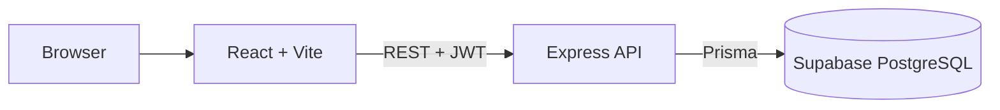

# PropertyFlow

## Real Estate Sales, CRM & Mortgage Platform

PropertyFlow is a full-stack real-estate platform that connects property discovery, mortgage affordability estimates, customer enquiries, viewing appointments, loan workflows and sales closing in one application. It demonstrates how a public customer experience and an internal role-aware CRM can share one secure relational backend.

> Portfolio demo: every person, property, bank and workflow record is fictional.

## Project overview

Property sales teams often move between listing pages, messages, spreadsheets, calendars and bank follow-ups. PropertyFlow keeps the customer journey and sales workflow together: customers explore and plan; agents act on assigned leads; admins manage inventory, users and global business data.

## Key features

### Customer

- Responsive Chonburi property listing, filters, details and image fallback
- Mortgage amortization, scenario comparison and interest-rate stress test
- Adjustable DTI affordability estimate and conservative safety range
- Deterministic property matching with scored reasons
- Registration/login, persistent JWT session and verified “I'm Interested” enquiries
- Customer dashboard, own leads, assigned agent and viewing appointments

### Agent CRM

- Seven-stage drag-and-drop pipeline with optimistic rollback
- Workload-aware agent assignment, lead priority and follow-up queues
- Notes, appointments and read-only activity timeline
- Financial Snapshot and neutral pre-qualification estimate
- Manual bank loan application workflow separated from calculator results
- Transactional deal creation, backend commission calculation and SOLD update
- Agent-scoped funnel, follow-up, activity, sales and inventory analytics

### Admin

- Global CRM visibility and analytics
- Property create/edit/delete permissions
- User and role management

## Customer and sales journeys

```text
Customer: Browse → Property Detail → Mortgage/Affordability → Login → Enquiry
Agent: Assigned Lead → Follow-up → Viewing → Negotiation → Booking → Closed Deal
Admin: Users + Inventory + Global Leads + Business Analytics
```

## Technology stack

| Layer | Technology |
| --- | --- |
| Frontend | React 19, TypeScript, Vite, Tailwind CSS, React Router |
| Backend | Node.js, Express 5, TypeScript, Zod |
| Authentication | JWT with expiry/issuer/audience validation, bcrypt |
| Database | PostgreSQL hosted on Supabase |
| ORM | Prisma |
| Tests/CI | Node test runner, GitHub Actions |

## Architecture and database



Supabase is used only as hosted PostgreSQL. Authentication and business logic remain in Express; the frontend never receives `DATABASE_URL` or direct database access.

- [Architecture documentation](docs/ARCHITECTURE.md)
- [Database models and ER diagram](docs/DATABASE.md)
- [REST API documentation](docs/API.md)

## Financial responsibility

Mortgage calculations, affordability and pre-qualification are planning estimates only. The default 40% DTI is adjustable and is not described as a universal bank rule. Calculator results return `LIKELY_WITHIN_ESTIMATE`, `BORDERLINE` or `ABOVE_ESTIMATED_BUDGET`—never APPROVED or REJECTED. Actual bank status is recorded manually by an authorized agent/admin.

## Demo accounts

| Role | Email | Password |
| --- | --- | --- |
| Customer | `customer@propertyflow.dev` | `Customer123!` |
| Agent | `agent@propertyflow.dev` | `Agent123!` |
| Admin | `admin@propertyflow.dev` | `Admin123!` |

These credentials are created by the seed and are intended only for a public portfolio demo containing fictional data. Set `VITE_SHOW_DEMO_ACCOUNTS=false` to hide login-page shortcuts.

## Local installation

Requirements: Node.js 22+, npm and a PostgreSQL/Supabase connection string.

```bash
git clone <your-repository-url>
cd condo
npm run install:all
```

Copy environment examples:

```bash
cp backend/.env.example backend/.env
cp frontend/.env.example frontend/.env
```

Configure values, then:

```bash
cd backend
npx prisma migrate deploy
cd ..
npm run prisma:seed --prefix backend
npm run dev
```

- Frontend: `http://localhost:5173`
- API health: `http://localhost:4000/api/health`

## Environment variables

### Backend

| Variable | Required | Description |
| --- | --- | --- |
| `DATABASE_URL` | Yes | Supabase PostgreSQL connection string |
| `JWT_SECRET` | Yes | Long random signing secret; never expose to frontend |
| `FRONTEND_URL` | Yes in production | Comma-separated allowed CORS origins |
| `PORT` | Host usually supplies | Express port, default 4000 |
| `NODE_ENV` | Recommended | `development`, `test` or `production` |

### Frontend

| Variable | Description |
| --- | --- |
| `VITE_API_URL` | Backend public URL ending in `/api` |
| `VITE_SHOW_DEMO_ACCOUNTS` | Set `false` outside a fictional public demo |

`.env` and `.env.*` are ignored except safe `.env.example` files.

## Testing and build

```bash
npm test --prefix backend
npm run build --prefix backend
npm run build --prefix frontend
```

Tests focus on financial formulas, matching, commission, JWT verification, role authorization and lead ownership. CI runs the same test/build sequence without real production secrets.

## Deployment readiness

### Backend — Render or Railway

1. Create a Node web service from the repository.
2. Set root/build configuration to install backend dependencies and run `npm run build --prefix backend`.
3. Start with `npm start --prefix backend`.
4. Configure `DATABASE_URL`, a new production `JWT_SECRET`, `NODE_ENV=production`, `PORT` and the final `FRONTEND_URL`.
5. Run `cd backend && npx prisma migrate deploy` as a controlled release step.
6. Confirm `/api/health` before connecting the frontend.

### Frontend — Vercel

1. Set the frontend project root to `frontend`.
2. Build with `npm run build`; output directory is `dist`.
3. Set `VITE_API_URL=https://<backend-host>/api`.
4. Set `VITE_SHOW_DEMO_ACCOUNTS` according to demo policy.
5. Add the final Vercel origin to backend `FRONTEND_URL` and redeploy the backend.
6. Test login and the customer → agent → closed-deal workflow.

No production deployment is claimed by this repository.

## Portfolio material

- [Case study](docs/CASE_STUDY.md)
- [Resume entry — English and Thai](docs/RESUME_PROJECT.md)
- [Interview guide](docs/INTERVIEW_GUIDE.md)
- [Product screenshots](docs/screenshots/README.md)

## Screenshots

Real screenshots captured from the local application with fictional seed data are available in the [`docs/screenshots`](docs/screenshots/README.md) gallery. They cover the customer journey, agent CRM, loan workflow and admin dashboard.


## Future improvements

- Isolated PostgreSQL integration-test environment and broader API workflow automation
- Rate limiting, refresh-token rotation and security headers
- Cloudinary/object-storage image management
- Accessibility and end-to-end browser automation
- Logging, monitoring and performance instrumentation
- Email/LINE notifications and real bank integrations only in a future phase

## Disclaimer

PropertyFlow does not approve loans and is not affiliated with a bank. Actual eligibility, approved amount, interest rate and repayment terms depend on each financial institution and the applicant's verified financial profile.
