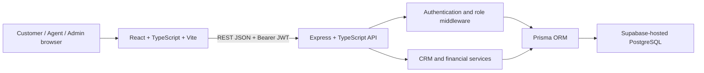

# Architecture

## Frontend

React Router separates public/customer screens from the CRM layout. ProtectedRoute improves navigation UX, while backend middleware remains authoritative. A centralized API client applies the configured `VITE_API_URL`, parses structured errors and expires invalid local sessions.

## Backend

Express owns authentication, authorization and business logic. JWTs expire after seven days and include issuer/audience validation. Passwords are hashed with bcrypt. Request bodies are JSON-limited and validated with Zod. CORS accepts only configured `FRONTEND_URL` origins.

## Service boundaries

- `agent-assignment.service`: selects the least-loaded seeded AGENT.
- `activity.service`: creates LeadActivity inside the caller's transaction.
- `matching.service`: deterministic property scoring and explanations.
- `prequalification.service`: neutral affordability comparison; no approval decision.
- `analytics.service`: lead funnel, sales and inventory aggregation.
- `finance` utilities: mortgage, reverse affordability, comparison and commission calculations.

Controllers enforce ownership and role rules, coordinate Prisma transactions and serialize Decimal values. Supabase provides PostgreSQL hosting only; Supabase Auth and client-side database access are intentionally not used.

## Transaction boundaries

Lead creation records initial activities in one transaction. Appointment/status/note/loan changes record related activity transactionally. Deal creation calculates commission on the backend and marks the property SOLD only after the deal write succeeds in the same transaction.
