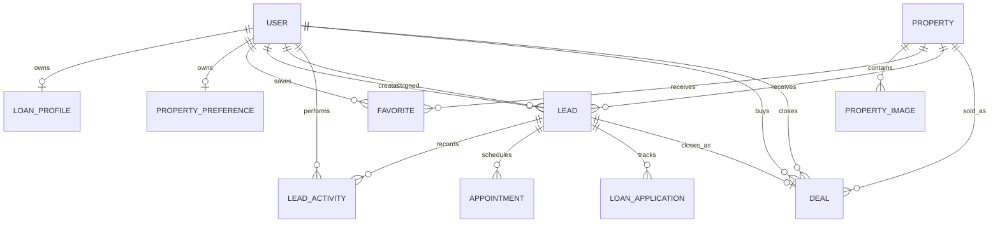

# Database design

PropertyFlow uses PostgreSQL hosted by Supabase and accessed only through Prisma in the Express backend. Financial database fields use `Decimal` where persistence requires monetary precision.

## Models

- **User:** customer, agent or admin identity. Email is unique; bcrypt hashes never leave the backend.
- **Property:** fictional listing, price, inventory status, characteristics and amenities.
- **PropertyImage:** ordered image URL belonging to one property.
- **LoanProfile:** customer income, itemized debt, down payment and planning assumptions. Calculated estimates are saved only where the product needs a reusable customer snapshot.
- **PropertyPreference:** one saved recommendation profile per customer.
- **Favorite:** customer/property join with a composite unique constraint.
- **Lead:** joins customer, property and assigned agent; stores sales stage, priority, notes and follow-up state.
- **LeadActivity:** immutable audit-style event with optional actor and JSON metadata.
- **Appointment:** viewing date, status and note for one lead.
- **LoanApplication:** manually recorded bank workflow. Its APPROVED status is a human-recorded external outcome, never calculator output.
- **Deal:** one-per-lead closed sale with persisted Decimal price/rate/commission.

Important indexes cover assigned lead stage/priority, follow-up time, activity chronology, appointment dates, application status and deal month/agent. The database also contains a migration-created partial unique index preventing duplicate active customer/property leads.
