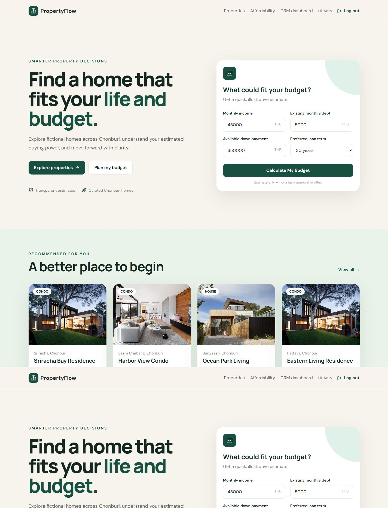
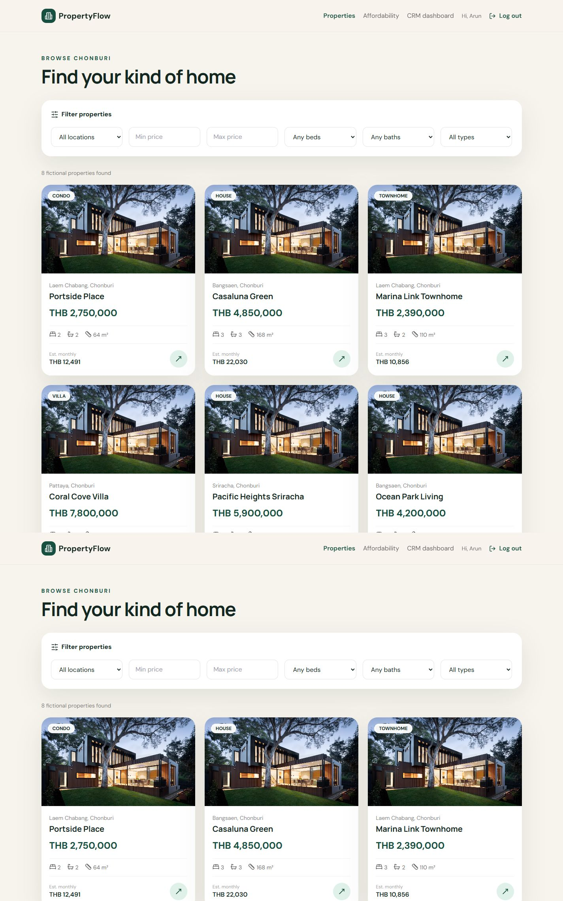
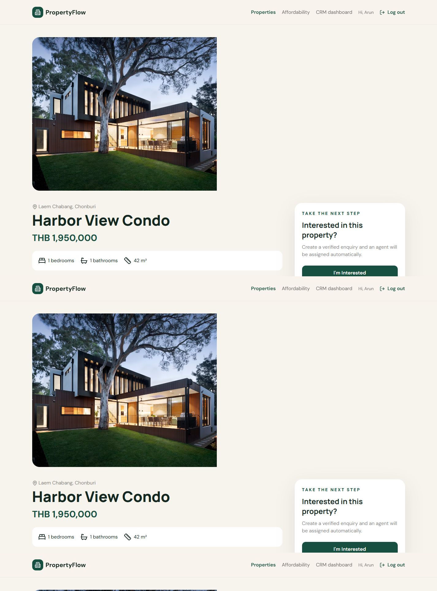
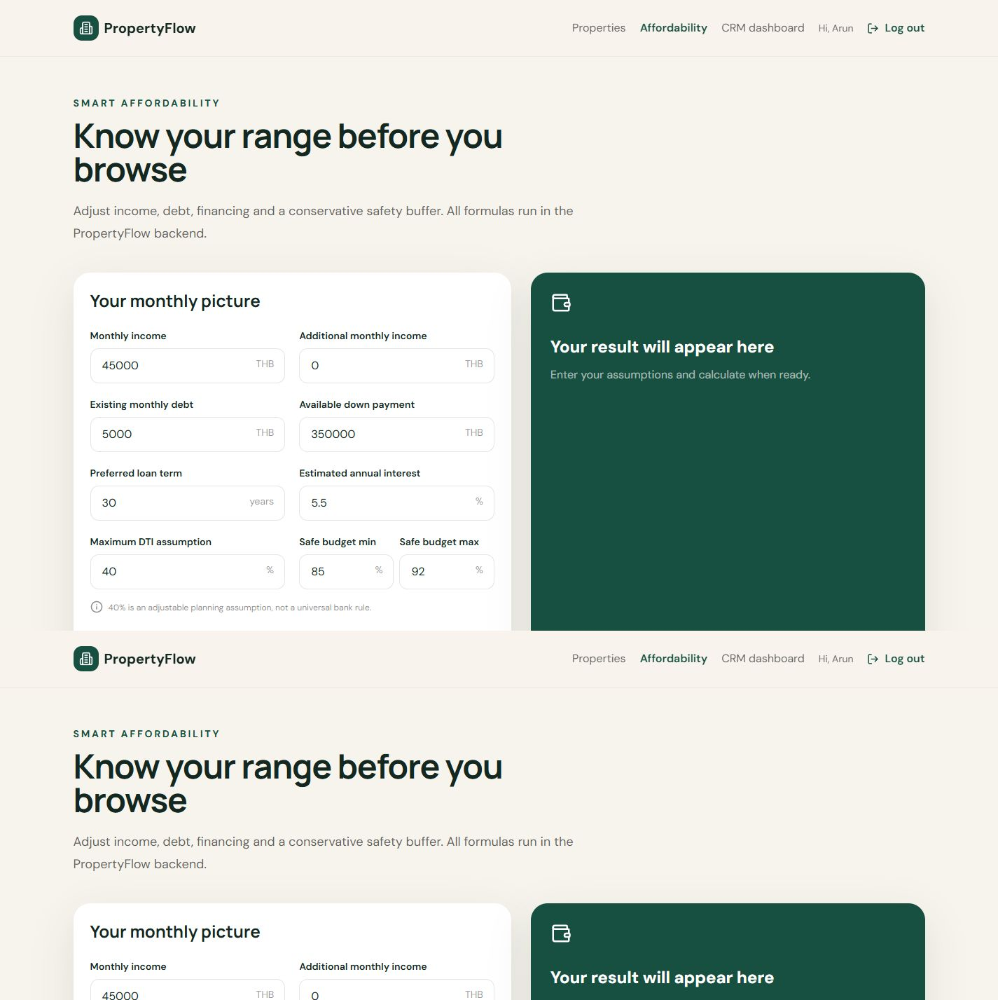
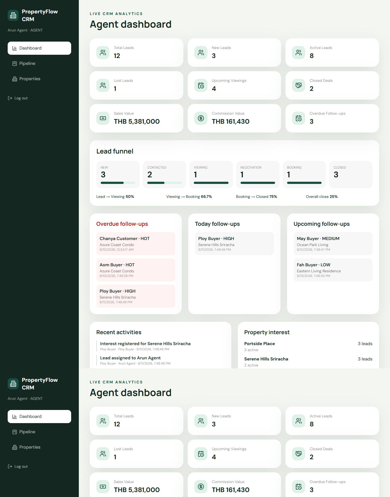
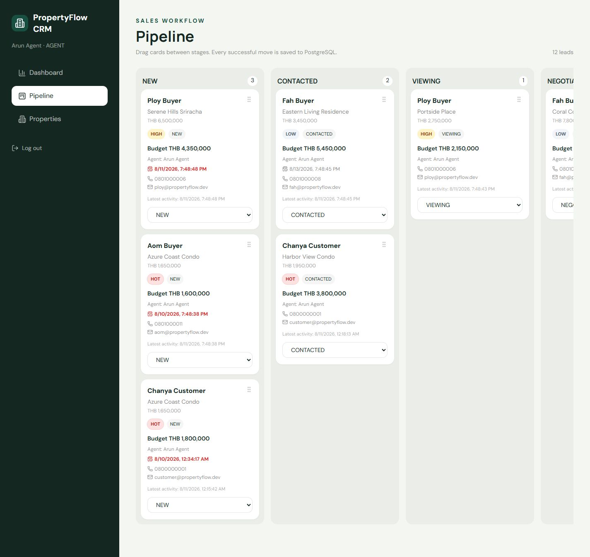
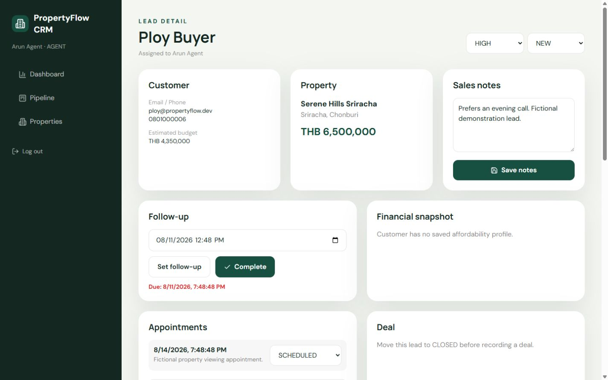
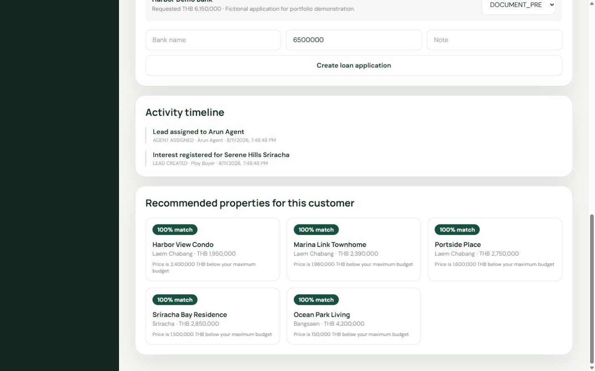
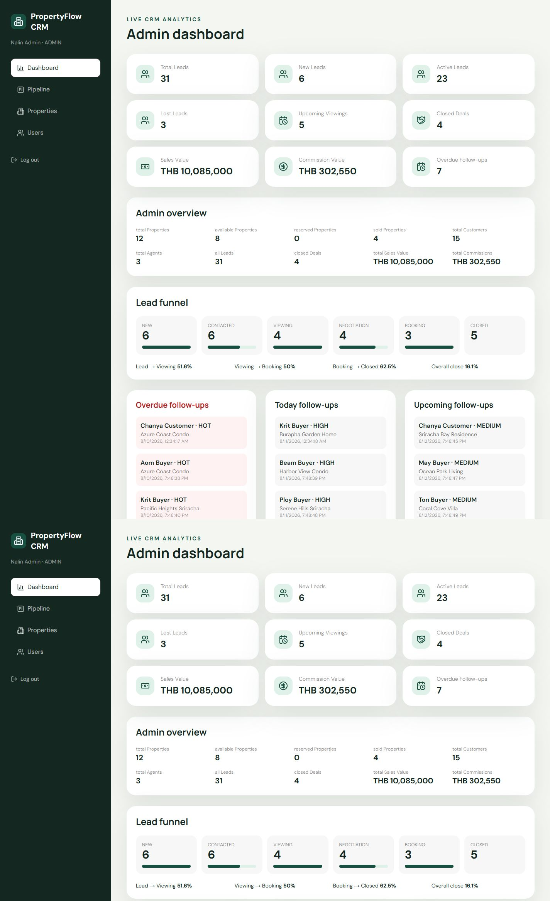

# PropertyFlow screenshots

These screenshots were captured from the local application at a 1440 × 900 desktop viewport using fictional seed data. No environment variables, access tokens, database credentials or real customer information are shown.

1. `01-home.png` — hero, affordability shortcut and featured properties.
2. `02-property-listing.png` — filters and responsive property cards.
3. `03-property-detail.png` — gallery, Financial Fit and mortgage calculator.
4. `04-affordability.png` — inputs, safer range and disclaimer.
5. `05-agent-dashboard.png` — KPIs, funnel and follow-up queues.
6. `06-kanban.png` — all seven stages with priority/follow-up cards.
7. `07-lead-detail.png` — customer/property snapshot and activity timeline.
8. `08-loan-workflow.png` — manual bank application status section.
9. `09-admin-dashboard.png` — global inventory, users and business metrics.

## Gallery

### Customer experience

### Agent CRM

### Administration

Before recapturing, reset with the documented seed, hide browser developer tools and ensure no `.env`, token or database information is visible.
